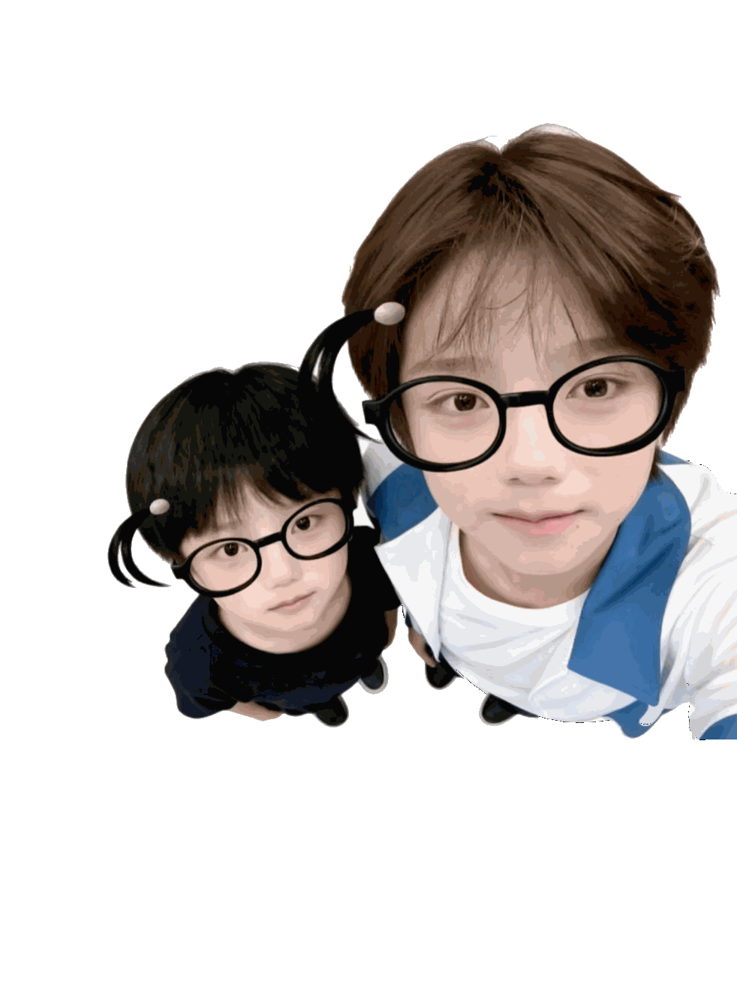
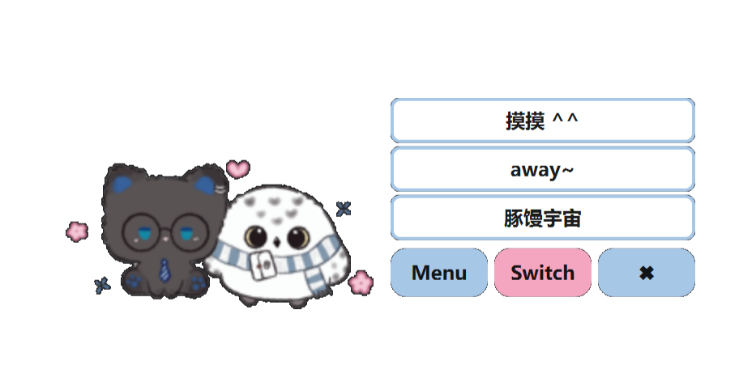
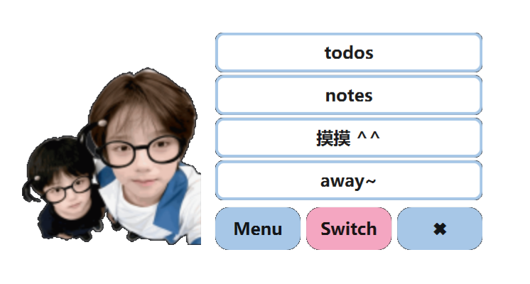
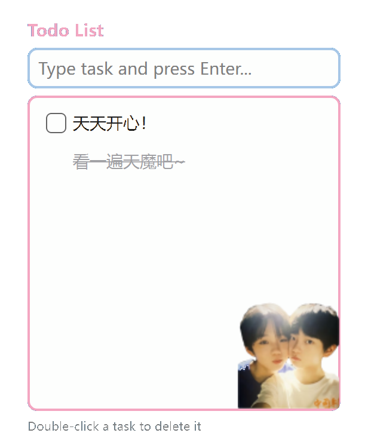
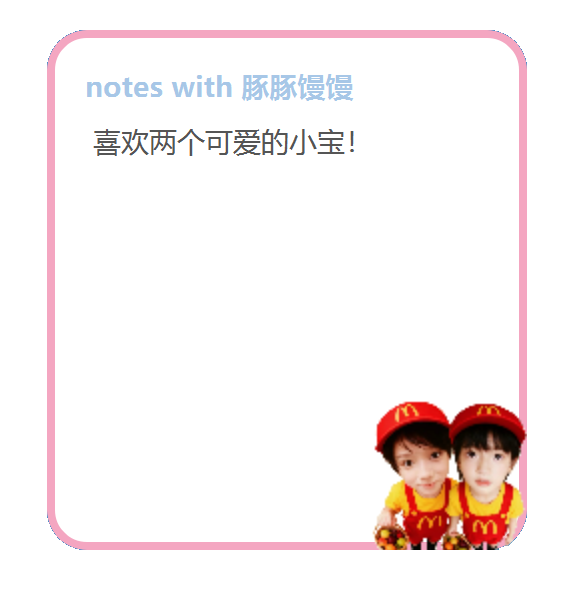

# 🐾 Desktop lulumumu

🩵🩷让可爱的豚豚馒馒在桌面上陪你一起玩吧！🩷🩵

 

---

## 📚 目录 Contents

- [项目动机 Motivation](#-项目动机-motivation)
- [功能介绍 Functions](#-功能介绍-functions)
  - [Chill 模式](#chill-模式)
  - [Work 模式](#work-模式)
- [使用小技巧 Tips](#-使用小技巧-tips)
- [技术栈 Tech Stack](#-技术栈-tech-stack)
- [致谢 Acknowledgement](#-致谢-acknowledgement)

---

## 💡 项目动机 Motivation

在一个很突然的晚上，想到如果我的桌面上有一个小小的豚豚馒馒，那该多可爱呢！
感谢科学技术的发展，感谢vibe coding，我也想给lulu和小木做点什么可爱的东西，所以有了今天的桌面宠物。
做这个项目的过程和任何一次比赛/项目都不一样，我第一次每天期待着coding，甚至写下这份README都充满乐趣，
也许这就是如此爱你们的原因，因为你们的存在本身就让人快乐。

祝大家玩的开心，希望lulu和小木可以陪伴大家度过每一个幸福或是悲伤的时刻，祝两个可爱的宝宝星途璀璨🩵🩷

## ✨ 功能介绍 Functions

### 😼 Chill 模式
和豚豚馒馒一起玩吧！🥰🥰🥰

支持功能：
- 🩵 **摸摸emo猫猫&小海德薇吧**
- 🩷 **触摸手出现并可拖动**
- 🎥 **away~**
- 🐾 **来到豚馒宇宙，和大家俩聊天**

---

### 💼 Work 模式
和豚豚馒馒一起工作吧！🥰🥰🥰

支持功能：

✅ **Todos 清单**

 

  - 添加任务
  - 勾选完成
  - 双击删除
  

📝 **Notepad 记事本**

- 随时记录想法

🩵 **摸摸豚豚馒馒吧**🩷

🎥 **away~**

⏱ **连续工作 10 分钟后解锁lulumumu新形象！** 🎉

---

## 🩷🩵 使用小技巧 Tips

### 🥰 给豚馒换个地方
- 鼠标拖动图像

### 🔁 模式切换
- 点击 **Switch** 切换 Chill / Work 模式

### 👋🏻 关闭程序
- 点击 **X** 直接退出程序

### 🦉 Chill 模式技巧
- 点击宠物 → 显示菜单
- 再次点击宠物 → 隐藏菜单
- 触摸宠物：
  - 会出现🫳🏻，手可以拖动
  - 6 秒后自动消失

### ☁️ Work 模式技巧

**Todos & Notepad**
- 可以拖动位置
- 再次点击 Todos / Notes → 隐藏窗口
- 点击宠物 → 隐藏菜单

**Todos**
- ➕ 添加任务
- ☑ 勾选完成
- 🖱 双击删除任务

**Notepad**
- ✍ 自由记录笔记内容

**触摸互动**
- 触摸手依然可以移动、互动🫳🏻

---

## 🛠 技术栈 Tech Stack

- 🐍 **Python**
- 🖼 **PyQt6 (Qt for Python)**
- 📦 **JSON**
  - 用于本地数据存储（Todos / Notes / 状态）

---

## 💖 致谢 Acknowledgement

> 祝我们亲爱的lulumumu星途璀璨，天天开心，睡个好觉 
> 
> 祝大家玩的开心 🐾💗
